

# UNIVERSIDAD DEL PACÍFICO

### Programa de Ingeniería de Sistemas

## Inteligencia Artificial

### Taller Practico Librerias Numpy Matplotlib Seaborn

# Análisis Estadístico Descriptivo y Visualización de Datos

 

 

**Estudiantes:** 

-Jhon Jader Riascos Angulo
-Charly Johan Murillo Hernández
-Gabriel Alejandro Sanchez Alarcon
-Brayan David Riascos Murillo

**Docente:** Wilman Andrés Quiñonez V.

**Semestre:** VIII

**Año:** 2026

# Descripción del Proyecto

Este proyecto desarrolla un caso de mantenimiento predictivo aplicado a una fábrica inteligente mediante el uso de las librerías NumPy, Matplotlib y Seaborn. El objetivo es analizar variables operativas de máquinas industriales para identificar patrones asociados a posibles fallas y proponer estrategias que permitan reducir paradas inesperadas.

Se generaron 500 observaciones sintéticas correspondientes a variables relacionadas con el funcionamiento de equipos industriales:

* Temperatura del motor.
* Vibración.
* Horas de uso.
* Consumo eléctrico.
* Estado de falla (Sí/No).

# Tecnologías Utilizadas

* Python 3
* NumPy
* Pandas
* Matplotlib
* Seaborn
* Jupyter Notebook

# Procedimiento Realizado

## 1. Generación de Datos Sintéticos

Se utilizaron distribuciones normales mediante NumPy para simular el comportamiento de las máquinas industriales.

Las fallas fueron determinadas a partir de condiciones de riesgo relacionadas con:

* Temperaturas elevadas.
* Vibraciones altas.
* Exceso de horas de funcionamiento.
* Consumo eléctrico superior al normal.

 

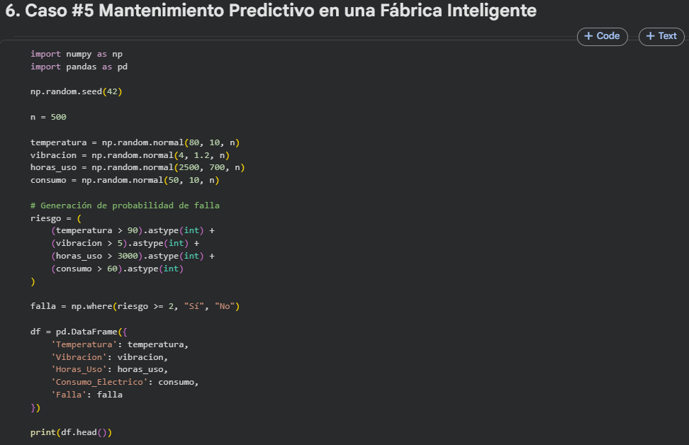

 

## 2. Análisis Estadístico

Se calcularon:

* Media
* Mediana
* Desviación estándar
* Percentiles
* Distribuciones de frecuencia

Los resultados permitieron identificar los rangos normales de operación y los posibles valores asociados a condiciones de riesgo.

 

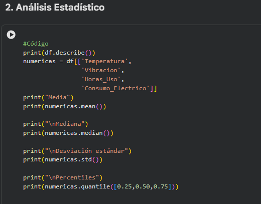

 
 

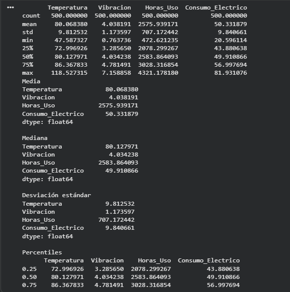

 
 

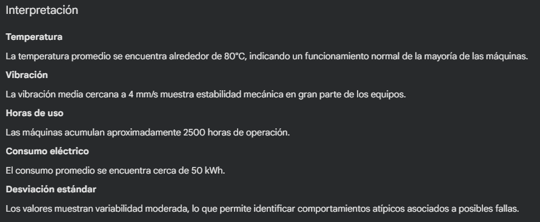

 

## 3. Visualización de Datos

Se desarrollaron los siguientes gráficos:

### Matplotlib

* Histograma de temperatura.
* Histograma de vibración.
* Dispersión temperatura vs vibración.
* Dispersión horas de uso vs consumo eléctrico.

 

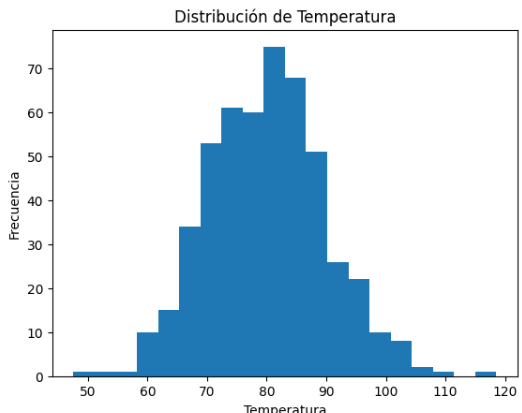

 
 

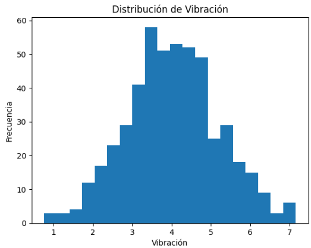

 
 

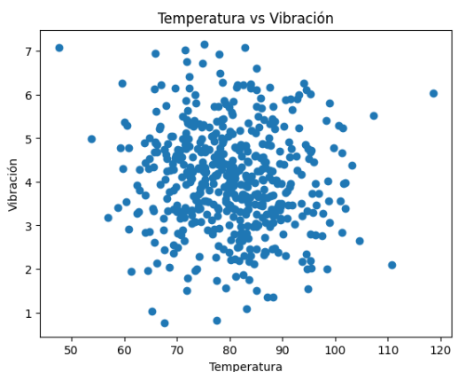

 
 

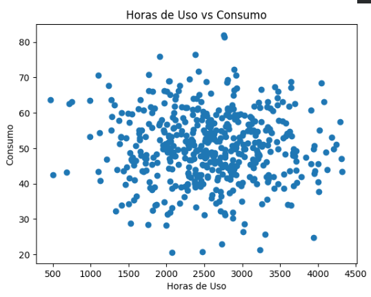

 

### Seaborn

* Heatmap de correlaciones.
* Pairplot de variables.
* Boxplot temperatura por estado de falla.
* Boxplot vibración por estado de falla.

Estas visualizaciones permitieron detectar relaciones importantes entre las variables operativas.

 

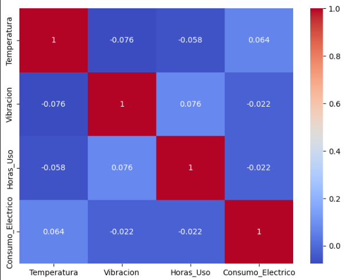

 

 

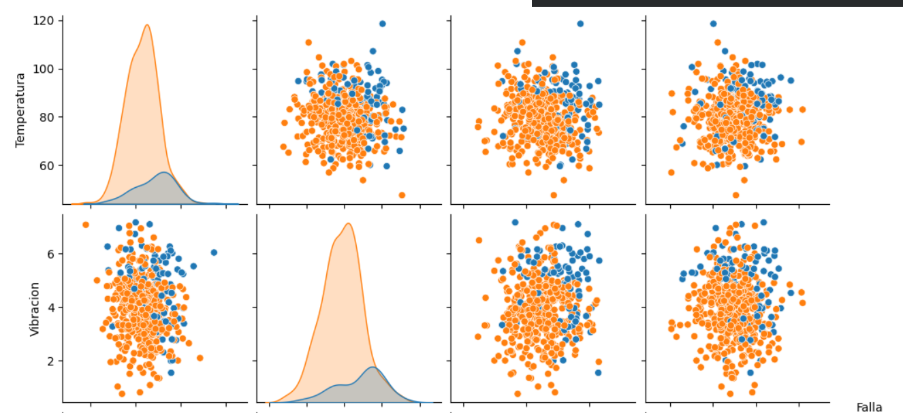

 

 

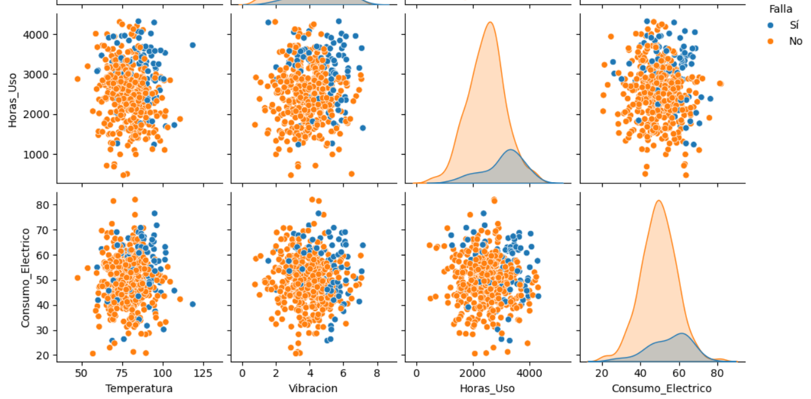

 

 

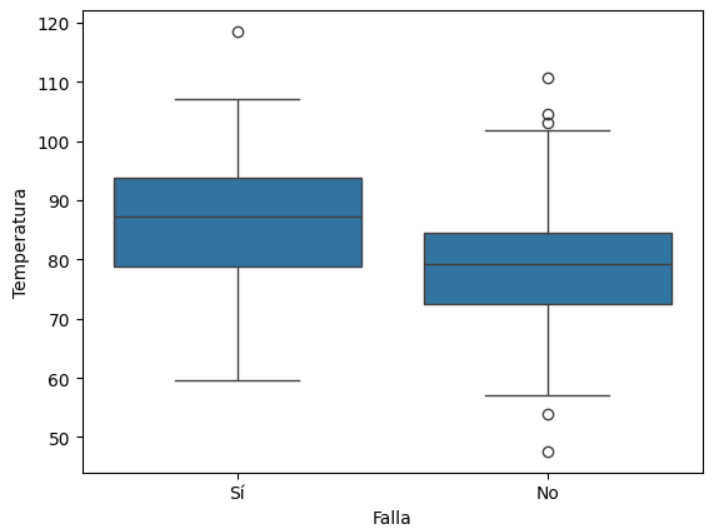

 

 

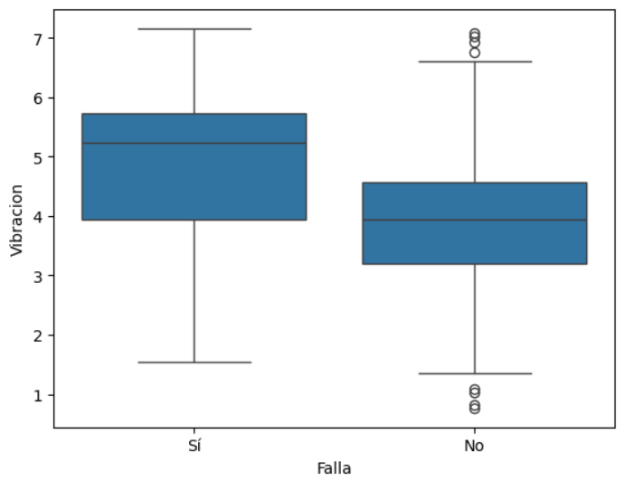

 

# Hallazgos Principales

* Las máquinas con falla presentan temperaturas más altas.
* Las vibraciones elevadas están asociadas a desgaste mecánico.
* El incremento de las horas de uso aumenta la probabilidad de falla.
* El consumo eléctrico puede actuar como indicador temprano de anomalías.
* La combinación de múltiples variables mejora significativamente la capacidad de predicción.

# Respuestas al Caso

## ¿Qué indicadores anticipan una falla?

Los principales indicadores identificados fueron:

* Temperatura superior a 90°C.
* Vibración superior a 5 mm/s.
* Más de 3000 horas de operación.
* Consumo eléctrico superior a 60 kWh.

## ¿Qué comportamiento tienen las máquinas defectuosas?

Las máquinas defectuosas presentan mayores niveles de temperatura, vibración, horas de uso acumuladas y consumo energético.

## ¿Qué beneficios tendría un sistema de mantenimiento predictivo basado en IA?

* Reducción de fallas inesperadas.
* Menores costos de mantenimiento.
* Mayor disponibilidad de equipos.
* Incremento de la productividad.
* Mejor planificación de recursos.

# Conclusiones

1. La temperatura es una de las variables más relevantes para anticipar fallas.
2. La vibración constituye un indicador importante del estado mecánico de las máquinas.
3. El desgaste asociado al tiempo de operación incrementa el riesgo de averías.
4. El monitoreo del consumo eléctrico ayuda a detectar comportamientos anómalos.
5. La combinación de variables permite construir modelos predictivos más precisos.

# Recomendaciones

1. Implementar sensores IoT para monitorear variables críticas en tiempo real.
2. Establecer umbrales automáticos de alerta para mantenimiento preventivo.
3. Desarrollar modelos de Machine Learning para predecir fallas futuras.

# Reflexión sobre Inteligencia Artificial

La Inteligencia Artificial permite analizar grandes volúmenes de datos generados por sensores industriales para identificar patrones asociados a fallas futuras. Mediante algoritmos de Machine Learning como Random Forest, XGBoost o Redes Neuronales, es posible automatizar la detección temprana de anomalías y optimizar los procesos de mantenimiento, reduciendo costos operativos y mejorando la productividad de la organización.
